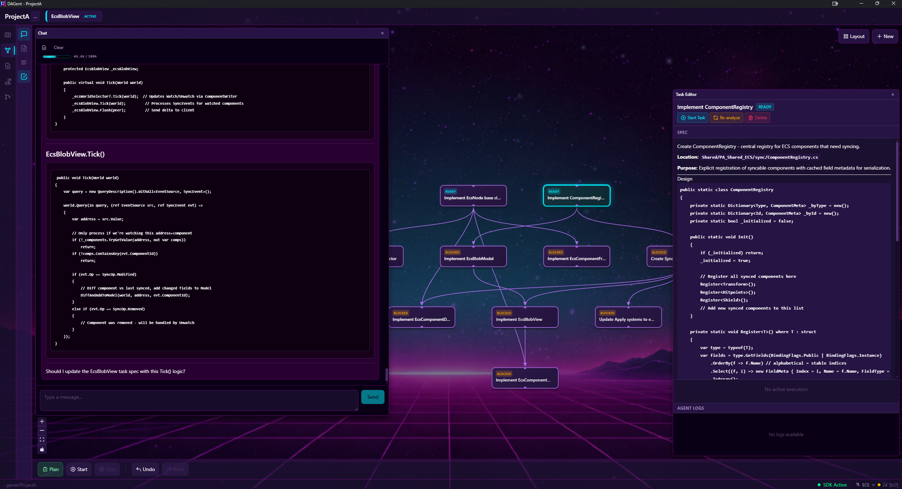

# DAGent

**AI-powered feature planning and dependency-aware task orchestration**

*in relaxing synthwave style*

[](LICENSE)
[](https://www.typescriptlang.org/)
[](https://www.electronjs.org/)
[](https://www.anthropic.com/)
[](https://github.com/cpgames/dagent/issues)

> **Early Development**: DAGent is in active development. Currently Windows-only. Other platforms have not been tested.



---

## Why DAGent?

**Visual, codebase-aware feature planning.** Describe what you want to build, and AI investigates your existing code, asks clarifying questions, and proposes a task breakdown that fits your architecture. You stay in control - refine the plan until it's right.

**Chat-driven workflow.** Manage your plan through conversation: *"Add a task for input validation"*, *"Make the API task depend on the schema task"*, *"Update the auth task to include refresh tokens"*. Natural language commands modify your task graph in real-time.

**Auto-generated specifications.** Each feature gets a detailed spec with goals, requirements, and acceptance criteria - documentation that guides all agents and defines what "done" looks like.

**Task dependencies.** Real features have tasks that depend on other tasks. DAGent models these as a dependency graph - tasks execute only when dependencies complete, with context flowing automatically from parent to child.

**Persistent, evolvable plans.** Your task graph persists and can be edited anytime - visually or via chat. Add tasks, adjust dependencies, attach mockups or design docs. Shape your implementation strategy before committing to code.

**Execution with clean git history.** When ready, DAGent executes tasks in dependency order. Each task produces independent commits in an isolated worktree - no merge conflicts. When complete, merge to main via PR or let the AI handle it.

---

## Key Features

| Feature | Description |
|---------|-------------|
| **Multi-Agent Architecture** | Specialized agents for different roles: Dev, QA, and Merge |
| **Parallel Worktrees** | Multiple worktrees enable concurrent feature execution - no merge conflicts |
| **Session Management** | Automatic context compaction keeps agents within token limits |
| **Iterative Development** | Dev agents iterate until tests pass, with automated verification |

---

## Recommended Workflow

1. **Start in Context view** - ideation and project setup:
   - Chat with AI to discuss ideas and plan your project
   - Review or create your `CLAUDE.md` file with project guidelines
   - Create features directly from the conversation
   - This context is shared with all agents during execution

2. **Create a feature** in the Kanban backlog - describe what you want to build

3. **Drag to "In Progress"** - this assigns the feature to a worktree

4. **Click the feature** to open the DAG view for planning

5. **Chat with AI** to create and refine tasks:
   - AI analyzes your feature, investigates the codebase, asks clarifying questions, and proposes a solution approach
   - Once ready, ask AI to create tasks: *"Create a task for user authentication"*
   - Ask AI to update tasks: *"Update the API task to include error handling"*
   - Ask AI to set dependencies: *"Make the database task depend on the schema task"*
   - AI won't modify tasks without explicit instruction - you're in control
   - Verify dependencies look correct in the visual graph
   - Use the **Task Editor** (left toolbar) to examine task details, specs, and logs

6. **Run tasks** - start individual tasks or use "Start All" to execute everything in dependency order

7. **Tasks flow through stages**: Ready → Dev → QA → Done, each generating a commit when complete
   - Click on a commit to see the diff

8. **When all tasks complete**, create a PR from the Kanban board and archive the feature

---

## Requirements

- **Claude API Key** or **Claude CLI** authentication
- **Git** installed and configured
- **Node.js** 18+ (for development)

---

## Installation

### Option 1: Download Installer (Recommended)

Download the latest Windows installer from [Releases](https://github.com/cpgames/dagent/releases).

Run `dagent-x.x.x-setup.exe` and follow the installation wizard.

### Option 2: Build from Source

```bash
# Clone the repository
git clone https://github.com/cpgames/dagent.git
cd dagent

# Install dependencies
npm install

# Run in development mode
npm run dev

# Or build the installer yourself
npm run build:win
```

The installer will be created in `dist/dagent-x.x.x-setup.exe`.

---

## Tech Stack

| Technology | Purpose |
|------------|---------|
| Electron | Cross-platform desktop application |
| React 19 | Modern UI with concurrent features |
| TypeScript | Type-safe codebase |
| Zustand | Lightweight state management |
| React Flow | DAG visualization and editing |
| Tailwind CSS v4 | Utility-first styling |
| Claude Agent SDK | AI agent interactions |
| simple-git | Git operations |

---

## Security

DAGent runs AI agents with filesystem access. Security measures include:

1. **Path Restrictions** - Agents can only access project directories
2. **Approval Workflows** - Critical operations require confirmation
3. **Local Storage** - All data stays on your machine
4. **No Telemetry** - No data sent to external servers

---

## Issues

Found a bug or have a feature request? [Report it here](https://github.com/cpgames/dagent/issues).

---

## License

MIT License - see [LICENSE](LICENSE) for details.

---

## Acknowledgments

Built with [Claude](https://www.anthropic.com/claude) by Anthropic.

Inspired by the vision of autonomous software development where AI agents collaborate effectively on complex projects.
