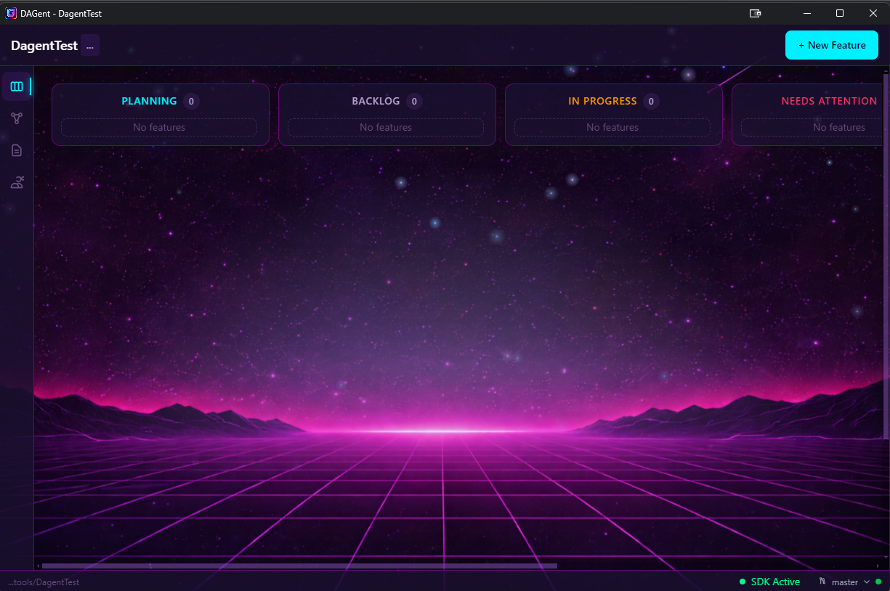
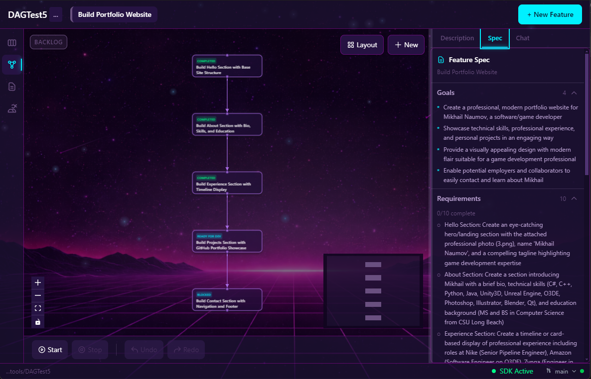

# DAGent

**Dependency-aware AI agent orchestration for autonomous software development**

[](LICENSE)
[](https://www.typescriptlang.org/)
[](https://www.electronjs.org/)
[](https://www.anthropic.com/)
[](https://github.com/cpgames/dagent/issues)

> **Early Development**: DAGent is in active development. Currently Windows-only. Other platforms have not been tested.

*video: planning demo*

[](https://www.youtube.com/watch?v=dFW4yiftykM)

---

## Why DAGent?

**The fundamental problem with parallel AI coding agents**: when multiple agents work on dependent tasks simultaneously, they produce incompatible outputs. One agent creates a function signature while another expects a different one. Merge conflicts multiply. Context gets lost.

**DAGent solves this** by orchestrating agents through a Directed Acyclic Graph (DAG). Tasks execute in correct dependency order, with context flowing from completed work to dependent tasks. The result: autonomous software development that actually works.

---

## Key Features

| Feature | Description |
|---------|-------------|
| **DAG-Based Execution** | Tasks execute in topological order - dependent tasks wait for their dependencies to complete |
| **Context Handoff** | Completed task context flows to dependent tasks automatically |
| **Multi-Agent Architecture** | Specialized agents for different roles: PM, Dev, QA, and Merge |
| **Git Worktree Isolation** | Each task branch is isolated - no conflicts until merge time |
| **Automatic Task Analysis** | PM agent analyzes and decomposes complex tasks into manageable pieces |
| **Session Management** | Automatic context compaction keeps agents within token limits |
| **Iterative Development** | Dev agents iterate until tests pass, with automated verification |
| **Visual DAG Editor** | Drag-and-drop task management with real-time dependency visualization |
| **Auto-Generated Specs** | Specs with goals, requirements, and acceptance criteria created automatically |
| **One-Click Merge** | AI-powered merge or automatic PR creation when features complete |
| **File Attachments** | Attach images, mockups, and reference files to features for agent context |

---

## Interface

### Kanban Board

Track features from backlog through completion. Start execution with one click and watch agents work autonomously.

<!-- Kanban screenshot placeholder -->


### DAG View

Visualize task dependencies as a directed graph. Edit tasks, manage connections, and monitor real-time progress. Chat with the PM agent to create tasks, refine requirements, and guide feature development.

<!-- DAG View screenshot placeholder -->


### Create New Feature

Simply describe what you want to build. DAGent handles the rest - analyzing complexity, decomposing into tasks, and orchestrating development.

<!-- Create feature screenshot placeholder -->


### Auto-Generated Specifications

Feature specs are automatically generated with goals, requirements, and acceptance criteria that guide all agents throughout development.

<!-- Spec viewer screenshot placeholder -->


---

## How It Works

```
┌─────────────────────────────────────────────────────────────────────────┐
│                         DAGent Orchestration                             │
├─────────────────────────────────────────────────────────────────────────┤
│                                                                          │
│   1. CREATE FEATURE                                                      │
│      ↓                                                                   │
│   2. PM AGENT analyzes and decomposes into tasks                        │
│      ↓                                                                   │
│   3. DAG ENGINE determines execution order                              │
│      ↓                                                                   │
│   4. DEV AGENTS work on ready tasks (dependencies satisfied)            │
│      ↓                                                                   │
│   5. QA AGENTS validate completed work                                  │
│      ↓                                                                   │
│   6. MERGE AGENT integrates approved changes                            │
│      ↓                                                                   │
│   7. REPEAT until feature complete                                      │
│                                                                          │
└─────────────────────────────────────────────────────────────────────────┘
```

### Agent Roles

| Agent | Responsibility |
|-------|----------------|
| **PM Agent** | Task decomposition, dependency inference, complexity analysis |
| **Dev Agent** | Code implementation with iterative refinement |
| **QA Agent** | Validation against acceptance criteria, test verification |
| **Merge Agent** | Branch integration, conflict resolution |

---

## Requirements

- **Claude API Key** or **Claude CLI** authentication
- **Git** installed and configured
- **Node.js** 18+ (for development)

---

## Project Structure

```
dagent/
├── src/
│   ├── main/                 # Electron main process
│   │   ├── agents/           # Agent implementations (PM, Dev, QA, Merge)
│   │   ├── dag-engine/       # DAG execution orchestrator
│   │   ├── services/         # Core services (Session, Context, Git)
│   │   └── ipc/              # IPC handlers
│   ├── preload/              # Electron preload scripts
│   ├── renderer/             # React frontend
│   │   ├── components/       # UI components (DAG, Kanban, Chat)
│   │   ├── stores/           # Zustand state management
│   │   └── hooks/            # Custom React hooks
│   └── shared/               # Shared types and utilities
└── docs/                     # Documentation

# Per-project data (created in each managed project):
.dagent-worktrees/            # Feature worktrees and metadata
├── {feature-id}/             # Feature worktree (git worktree)
│   └── .dagent/              # Feature metadata
│       ├── feature.json      # Feature definition
│       ├── dag.json          # Task DAG graph
│       ├── feature-spec.md   # Auto-generated specification
│       ├── attachments/      # Uploaded files (images, docs)
│       ├── sessions/         # Agent session data
│       └── nodes/{task-id}/  # Per-task data
└── {feature-id}--task-{id}/  # Task worktrees
```

---

## Architecture Highlights

### Session Management

DAGent automatically manages context windows for long-running agents:
- **Token tracking** estimates usage in real-time
- **Auto-compaction** at 90k tokens preserves key context
- **Checkpoints** allow agents to resume with full history

### Git Integration

Every task runs in an isolated git worktree:
- No conflicts during parallel development
- Clean commit history per task
- Automatic branch management
- One-click merge when ready

### DAG Execution

The orchestration engine ensures correct execution order:
- Topological sorting of task dependencies
- Automatic task assignment to available agents
- Real-time status updates and progress tracking
- Graceful handling of failures with retry logic

---

## Tech Stack

| Technology | Purpose |
|------------|---------|
| Electron | Cross-platform desktop application |
| React 19 | Modern UI with concurrent features |
| TypeScript | Type-safe codebase |
| Zustand | Lightweight state management |
| React Flow | DAG visualization and editing |
| Tailwind CSS v4 | Utility-first styling |
| Claude Agent SDK | AI agent interactions |
| simple-git | Git operations |

---

## Security

DAGent runs AI agents with filesystem access. Security measures include:

1. **Path Restrictions** - Agents can only access project directories
2. **Approval Workflows** - Critical operations require confirmation
3. **Local Storage** - All data stays on your machine
4. **No Telemetry** - No data sent to external servers

---

## Issues

Found a bug or have a feature request? [Report it here](https://github.com/cpgames/dagent/issues).

---

## License

MIT License - see [LICENSE](LICENSE) for details.

---

## Acknowledgments

Built with [Claude](https://www.anthropic.com/claude) by Anthropic.

Inspired by the vision of autonomous software development where AI agents collaborate effectively on complex projects.
